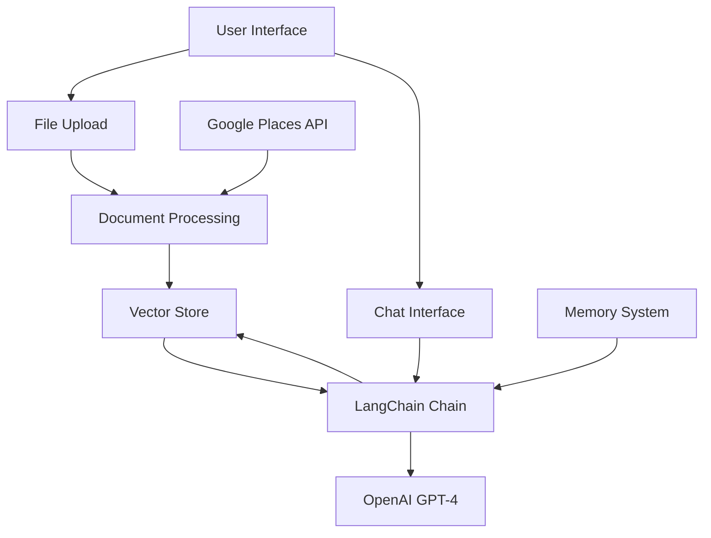
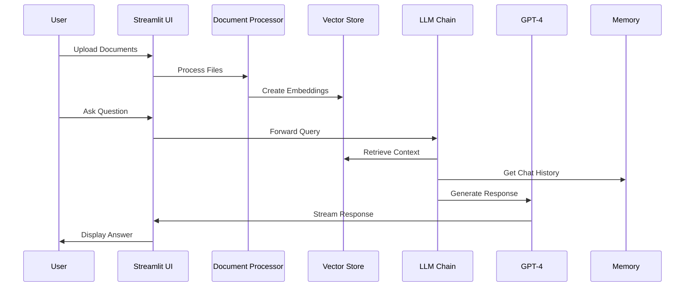

# AI-Powered Restaurant Chatbot 🍽️

An interactive Streamlit application that enables users to analyze restaurant data through natural language conversations, powered by GPT-4 and LangChain.

## Features

- 📊 Upload and analyze restaurant datasets (CSV, PDF, DOCX, TXT)
- 🤖 Natural language interaction with data
- 📈 Automatic data visualization and analysis
- 🌐 Integration with Google Places API
- 💾 Conversation memory
- 📑 Source attribution for responses

## Prerequisites

- Python 3.8+
- OpenAI API key
- Google Places API key (optional, for external data)

## Installation

1. Clone the repository:
```bash
git clone <repository-url>
cd restaurant-chatbot
```

2. Install dependencies:
```bash
pip install -r requirements.txt
```

3. Set up environment variables:
```bash
# Create .streamlit/secrets.toml
OPENAI_API_KEY = "your-openai-key"
GOOGLE_PLACES_API_KEY = "your-google-places-key"  # Optional
```

## Architecture

### System Architecture


### Data Flow


### How It Works

1. **Document Processing**
   - Files uploaded via Streamlit interface
   - Text extraction based on file type (PDF, DOCX, TXT, CSV)
   - Documents split into chunks with overlap
   - Embeddings created using OpenAI

2. **Vector Store**
   - Document chunks stored in Chroma DB
   - Similarity search using MMR for diversity
   - Metadata preserved for source tracking

3. **Query Processing**
   - User questions processed through LangChain
   - Relevant context retrieved from vector store
   - Chat history maintained in memory
   - Context-aware responses generated by GPT-4

4. **External Data Integration**
   - Real-time restaurant data from Google Places
   - Location-based search and filtering
   - Results integrated with local data

## Project Structure

```
├── app.py                  # Main Streamlit application
├── chat_with_documents.py  # LangChain conversation chain setup
├── google_api.py          # Google Places API integration
├── memory.py              # Conversation memory management
├── utils.py               # Utility functions and classes
└── requirements.txt       # Project dependencies
```

## Usage

1. Start the application:
```bash
streamlit run app.py
```

2. Upload restaurant-related datasets using the sidebar
3. (Optional) Enable external data to fetch real-time restaurant information
4. Ask questions about your data through the chat interface

## Features in Detail

### Data Processing
- CSV analysis with automatic visualization
- Support for multiple file formats
- Batch processing for large documents
- Automatic encoding detection

### Conversation Features
- Context-aware responses
- Conversation history
- Source attribution
- Streaming responses

### Analytics
- Automatic data profiling
- Distribution analysis
- Missing value detection
- Categorical and numerical analysis

## API Integrations

### OpenAI
- Uses GPT-4 for natural language understanding
- Embeddings for document similarity
- Streaming responses for better UX

### Google Places (Optional)
- Real-time restaurant data
- Location-based search
- Detailed restaurant information

## Error Handling

- File validation
- API error recovery
- Graceful fallbacks
- Detailed logging

## Limitations

- Maximum file size: 200MB
- API rate limits apply
- Some features require API keys
- Limited to text-based data

## Contributing

1. Fork the repository
2. Create a feature branch
3. Commit changes
4. Push to the branch
5. Submit a pull request

## Contact

vrtteja001@ksu.edu
